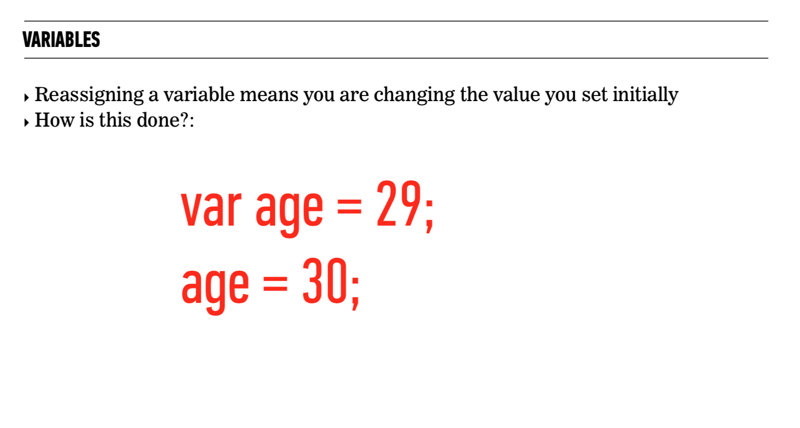

# Javascript Intro

## [JavaScript-Equality-Table](https://dorey.github.io/JavaScript-Equality-Table/)

# Fizzbuzz

- Write a program that declares a variable equal to a number 0 - 100

- If it is a multiple of 3, print “Fizz” instead of the number.

- If it is a multiple of 5, print “Buzz” instead of the number.

- If it is a multiple of both 3 and 5, print “FizzBuzz” instead of the number.

- Otherwise, print the number

# Functions

# Fizzbuzz

- Write a function that accepts an argument of a number equal to a number 0 - 100

- If it is a multiple of 3, return “Fizz” instead of the number.

- If it is a multiple of 5, return “Buzz” instead of the number.

- If it is a multiple of both 3 and 5, return “FizzBuzz” instead of the number.

- Otherwise, return the number

## Additional Resources

- https://javascript.info/
- https://www.codeanalogies.com/